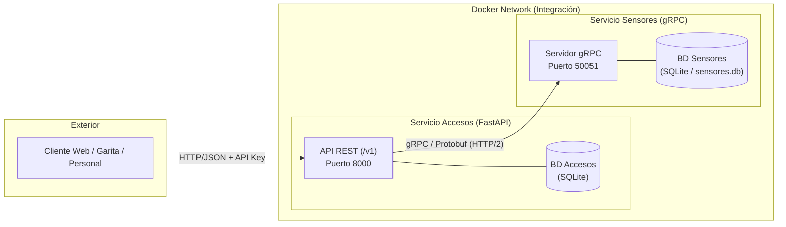
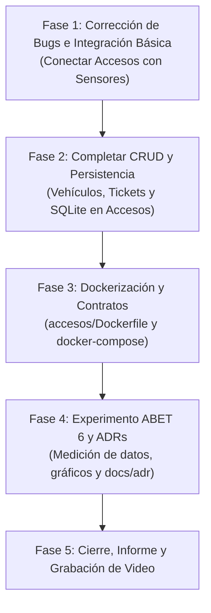

# 🚗 Encargo Unidad 1: Integración de Sistemas (Forma C)

> [!abstract] Resumen del Dominio
> **Operadora de Estacionamientos del Centro**: Integración de dos subsistemas previamente aislados bajo el patrón **"REST hacia afuera, gRPC hacia adentro"**:
> 1. **Accesos (API REST Pública)**: Interfaz externa para registrar vehículos, emitir tickets de entrada y procesar salidas/reversiones. Requiere validar disponibilidad antes de crear tickets.
> 2. **Sensores (Servicio gRPC Interno)**: Mantiene la verdad sobre la capacidad y plazas libres en cada sector físico. Canal interno de alto volumen no expuesto al exterior.

---

## 🚨 1. Errores Críticos e Inconsistencias Actuales (Prioridad 0)

> [!danger] ¡Atención! El sistema actualmente no funciona de extremo a extremo
> Hay discrepancias directas entre el código desarrollado por los integrantes que deben resolverse antes de seguir programando:

- [ ] **Bug gRPC en Accesos**: En `accesos/main.py` se invoca `stub.ConsultarDisponibilidad(...)`, pero en `contratos/sensores.proto` y `sensores/main.py` el método se llama **`ConsultarSector`**. Lanza error en runtime.
- [ ] **Bug de Tipo Protobuf**: En `accesos/main.py` se envía un mensaje `SectorRequest` a `OcuparPlaza(...)`. El contrato exige **`ModificarPlazaRequest`**.
- [ ] **Dockerfile de Sensores roto**: En `sensores/Dockerfile` la línea 8 hace `COPY proto/sensores.proto ./proto/`, pero el archivo fue movido a `contratos/sensores.proto`. El `docker build` falla.
- [ ] **Docker Compose Incompleto (T1)**: `docker-compose.yml` **solo** levanta Sensores. No existe `accesos/Dockerfile` ni está declarado el servicio `accesos`.
- [ ] **Semántica de Error 401 vs 403 (T6)**: `accesos/main.py` devuelve 403 si la API Key es errónea. La rúbrica pide expresamente distinguir: **401 Unauthorized** (falta API Key o es inválida) vs **403 Forbidden** (sin permisos).
- [ ] **Archivos sin seguimiento en Git**: Hay eliminaciones de `openapi.yaml` y `proto/sensores.proto` sin commitear en la raíz y la carpeta `contratos/` figura como untracked.

---

## 📋 2. Matriz de Requisitos y Estado de Implementación

### 2.1 Requisitos Funcionales Mínimos

#### 🏢 Sistema de Accesos (API REST)
- [ ] **Gestión de Vehículos**:
  - [ ] `POST /v1/vehiculos` (Registrar vehículo: patente, marca, modelo).
  - [ ] `GET /v1/vehiculos/{patente}` (Consultar datos de un vehículo).
  - [ ] `GET /v1/vehiculos` (Listar vehículos registrados).
  > [!note] Estado: `accesos/routers/vehiculos.py` está completamente vacío.
- [ ] **Gestión de Tickets**:
  - [x] `POST /v1/tickets` (Emitir ticket con verificación de plazas gRPC). *(Falta corregir bugs de llamada).*
  - [ ] `GET /v1/tickets/{id}` (Consultar ticket específico).
  - [ ] `GET /v1/tickets` (Listar todos los tickets).
  - [ ] `POST /v1/tickets/{id}/revertir` o `PUT /v1/tickets/{id}/salida` (Revertir ticket o registrar salida, llamando a `LiberarPlaza` en Sensores).
  > [!note] Estado: `accesos/routers/tickets.py` está vacío; solo hay un endpoint en `main.py`.

#### 📡 Sistema de Sensores (Servicio gRPC)
- [x] Consultar disponibilidad de un sector (`ConsultarSector`).
- [x] Listar sectores con cantidad de plazas libres y totales (`ListarSectores`).
- [x] Ocupar plaza al ingresar vehículo (`OcuparPlaza` resta 1 libre).
- [x] Liberar plaza al salir/revertir (`LiberarPlaza` suma 1 libre, validando límite).
> [!success] Estado: El servidor gRPC en `sensores/main.py` está 100% programado con base SQLite funcional.

---

### 2.2 Requisitos Técnicos Obligatorios (T1 - T7)

| Código | Requisito | Estado | Tarea Pendiente |
| :--- | :--- | :---: | :--- |
| **T1** | **Todo Dockerizado** | 🔴 Incompleto | Crear `accesos/Dockerfile`, compilar `.proto` y orquestar ambos en `docker-compose.yml`. |
| **T2** | **API REST Versionada** | 🟡 Parcial | Tiene prefijo `/v1`, pero faltan la mayoría de los endpoints y respuestas JSON de error estándar. |
| **T3** | **Contrato Explícito** | 🟡 Parcial | `sensores.proto` está completo. `openapi.yaml` solo tiene 1 endpoint y le faltan schemas de error/vehículos. |
| **T4** | **Servicio gRPC Interno** | 🟡 Parcial | Servidor operativo; cliente en `accesos` roto por discrepancia de llamadas. |
| **T5** | **Base de Datos por Servicio** | 🟡 Parcial | `sensores` tiene SQLite propio. `accesos` usa un diccionario en memoria (debe migrarse a SQLite). |
| **T6** | **Autenticación en REST** | 🟡 Parcial | API Key implementada pero retorna 403 en vez de 401. Falta justificación en informe. |
| **T7** | **Manejo de Fallas (Resiliencia)**| 🟡 Parcial | Captura `grpc.RpcError` con HTTP 503. Falta configurar **timeout** en la llamada y documentarlo. |

---

### 2.3 Requisitos Opcionales (Bonificación: hasta +1.0 pto)

> [!tip] Cada mejora implementada y justificada suma hasta +0.3 puntos a la nota final:
- [ ] **O1 - Caché con Redis**: Cachear la disponibilidad de sectores frecuentemente consultados, invalidando la caché al ocupar o liberar plaza.
- [ ] **O2 - Idempotencia**: Manejar cabecera `Idempotency-Key` en `POST /v1/tickets` para evitar dobles cobros/emisiones si el cliente reintenta la petición.
- [ ] **O3 - HATEOAS**: Añadir hipermedios dinámicos en la respuesta del ticket (ej: link rel `"revertir"` si está activo).
- [ ] **O4 - Pruebas de Contrato**: Tests automatizados (ej: Schemathesis o Dredd para OpenAPI, y tests unitarios sobre `.proto`).
- [ ] **O5 - Segundo Cliente gRPC**: Crear un cliente en otro lenguaje (ej. script en Go, Node.js o CLI) que consulte los sectores para evidenciar interoperabilidad.

---

## 📑 3. Componente de Investigación y Arquitectura (ADRs)

El informe exige documentar 4 decisiones arquitecturales bajo el formato ADR:

- [ ] **ADR D1 — Estilo de Integración y Descomposición** *(FALTA)*:
  - ¿Por qué dos microservicios y no un monolito?
  - Frontera de Bounded Context (Estacionamiento Físico vs Facturación/Accesos).
  - ¿Qué datos se duplican intencionalmente (ej. `sector_id` y `patente`) y qué costo acarrea?
- [x] **ADR D2 — REST frente a gRPC** *(IMPLEMENTADO)*:
  - Ubicado en `docs/adr/ADR-002.md`.
  - Justifica REST/JSON para la cara pública y gRPC/Protobuf para la comunicación interna.
- [x] **ADR D3 — Contrato, Versionado y Evolución** *(IMPLEMENTADO)*:
  - Ubicado en `docs/adr/ADR-003-Contrato.md`.
  - Versionado URL `/v1` en REST y retrocompatibilidad de campos opcionales en Protobuf.
- [ ] **ADR D4 — Resiliencia y Modos de Falla** *(FALTA)*:
  - ¿Qué ocurre si Sensores se cae o responde con alta latencia?
  - Justificación del código `503 Service Unavailable` vs `500` o `504 Gateway Timeout`.
  - Uso de Circuit Breaker, Retries con Timeout y degradación elegante.

---

## 🔬 4. Competencias ABET Evaluadas

### 🎯 Competencia 6: Experimentación y Conclusiones (PESO: 40%)
> [!important] ¡Es el 40% de la nota!
> No puede ser una simple comparación anecdótica. Exige:
> 1. **Hipótesis definida** (ej: *"El payload binario de Protobuf reduce el tamaño de transferencia en al menos un 50% respecto a JSON para la consulta de sectores"*).
> 2. **Metodología y control de variables** (tamaño idéntico de datos, múltiples repeticiones, pruebas con y sin compresión gzip).
> 3. **Datos cuantitativos en tablas y gráficos**.
> 4. **Conclusiones de ingeniería con matices** (costos de serialización vs ahorro de red).

#### Alternativas de Experimento para Elegir:
1. **Tamaño del mensaje**: Comparar bytes transferidos en `ListarSectores` (gRPC/Protobuf) vs `GET /sectores` (REST/JSON).
2. **Efecto del Timeout**: Medir latencia percibida por el cliente REST inyectando retrasos artificiales en Sensores (con timeout de 2s vs sin timeout).
3. **Latencia con Caché**: Medir tiempos de respuesta en consultas de sectores con Redis vs consulta directa a SQLite.

### 🏛️ Competencia 2: Factores de Contexto (PESO: 30%)
- Justificar en el informe al menos un factor del mundo real:
  - **Seguridad/Privacidad**: Protección de las patentes vehiculares de los conductores.
  - **Costo Operacional**: Ahorro en cómputo/ancho de banda en la red interna gracias a gRPC.
  - **Impacto de Negocio**: Evitar colas en la barrera de entrada si el sistema gRPC se degrada.

### 📐 Competencia 1: Formulación y Resolución (PESO: 30%)
- Calidad de la descomposición, justificación técnica frente a alternativas y consistencia del diseño.

---

## 📦 5. Entregables Obligatorios

- [ ] **1. Informe Técnico en PDF (10 a 20 páginas)**:
  - Portada oficial UdeC (Forma C - Sistema de Gestión de Estacionamiento).
  - Análisis del problema y descomposición arquitectónica con diagramas.
  - Los 4 ADRs (D1 a D4).
  - Sección completa del Experimento ABET 6 (Hipótesis, método, datos, gráficos, conclusiones).
  - Justificación de contexto (ABET 2).
  - Guía de levantamiento con Docker.
  - Reflexión final (lecciones aprendidas y trabajo futuro).
- [ ] **2. Video Demostrativo (Máximo 8 minutos)**:
  - Demostración de `docker compose up` iniciando todo limpio.
  - Flujo de prueba: registrar vehículo, emitir ticket (consume gRPC), verificar rechazo cuando no hay plazas libres, liberar plaza / revertir.
  - **Demostración de falla T7**: Apagar el contenedor de Sensores (`docker stop gRPC_sensores`) y mostrar que la API REST responde ordenadamente con `503`.
  - Narración explicativa de las decisiones de diseño.
- [ ] **3. Repositorio Git**:
  - Código estructurado en carpetas independientes (`accesos/`, `sensores/`, `contratos/`, `docs/adr/`).
  - `README.md` completo: instrucciones de despliegue y **declaración explícita de uso de herramientas de IA** (qué se usó, para qué y cómo se verificó).
  - Historial de commits equilibrado y trazable por cada integrante del grupo.

---

## 🚀 6. Roadmap de Trabajo Recomendado

### Sprint de Tareas Inmediatas:
- [ ] **Tarea 1**: Alinear nombres de métodos y mensajes en `accesos/main.py` (`ConsultarSector` y `ModificarPlazaRequest`).
- [ ] **Tarea 2**: Implementar `accesos/routers/vehiculos.py` y `accesos/routers/tickets.py`.
- [ ] **Tarea 3**: Configurar base de datos SQLite para `accesos` (`accesos.db`).
- [ ] **Tarea 4**: Crear `accesos/Dockerfile` y actualizar `docker-compose.yml` para levantar ambos servicios en la misma red Docker.
- [ ] **Tarea 5**: Completar `contratos/openapi.yaml` con todos los endpoints.
- [ ] **Tarea 6**: Redactar ADR D1 y ADR D4.
- [ ] **Tarea 7**: Ejecutar las mediciones para el Experimento ABET 6.
- [ ] **Tarea 8**: Redactar el informe PDF y grabar el video.
